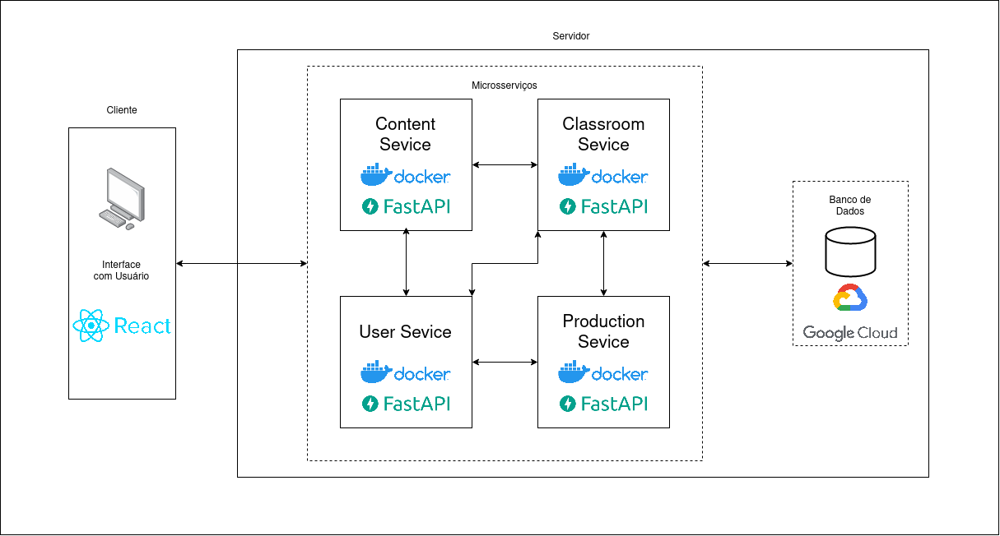

# AMIS - UserService

<p align="center" >
     </div>
</p>
<br/>

## Sobre o Projeto

O AMIS é um projeto da ONG Instituto Mulheres Criativas que tem como objetivo auxiliar no desenvolvimento e capacitação de pessoas atráves de cursos, palestras e oficinas de culinária. O projeto de um Plataforma de Franquia Social surgiu no segundo semestre do ano de 2022, sendo desenvolvido pelas disciplinas de EPS e MDS da Universidade de Brasília.

A principal tônica do projeto é oferecer suporte as atividades das ONG's, apoiando sua missão de capacitar mulheres por meio de cursos gratuítos e outras ações sociais, para isso o Amis se propõe a amenizar o esforço em tarefas burocraticas na gerencia das atividades da ONG.

Este repositório contém o código-fonte do backend do projeto AMIS, seguindo uma arquitetura de microserviços, sendo este o microserviço de usuários, que acomoda o login, logout e as funcionalidades relacionadas a assistente social, aluno, professor.

## Tecnologias do Projeto

<div style="display: flex">

    

    


</div>

## Arquitetura dos Microserviços

<div align="center">

</div>


## Como subir o ambiente

- Primeiramente crie e/ou copie o arquivo `.env` e preencha com as configurações de acordo com o seu ambiente.
```
DB_CONNECT_URL=
SECRET_KEY=
JWT_ALGORITHM=
ALGORITHM=
ACCESS_TOKEN_EXPIRE_HOURS=
ENV=DEV
```
- É necessário possuir o `docker ` e o `docker-compose` instalados na máquina
- Por fim execute o seguinte comando.

```bash
sudo docker-compose up --build
```
- As tabelas do banco de dados são geradas automaticamente.


## Testes
- Para rodar os testes é recomendado executar dentro do docker:

```bash
pyteste
```

## Licença
O AMIS está sob as regras aplicadas na [Licença MIT](./LICENSE).

## Contribuição
Para contribuir com o projeto, certifique-se de ler o [Guia de Contribuição](https://fga-eps-mds.github.io/2023.1-Amis-Doc/#/organization/contribution-guide).


## Deploy

[Ambiente AMIS](http://100.27.26.213:5173/)
